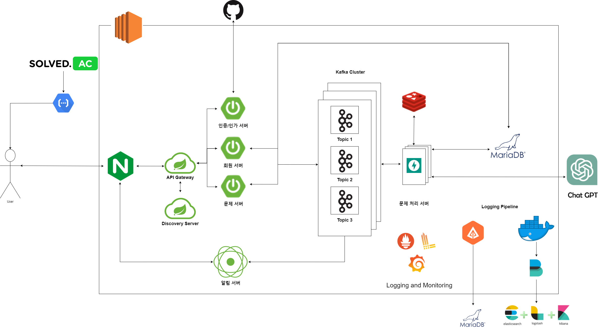
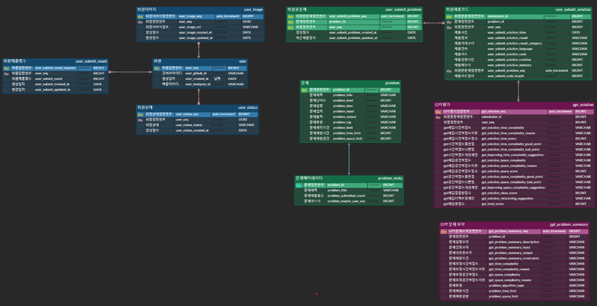
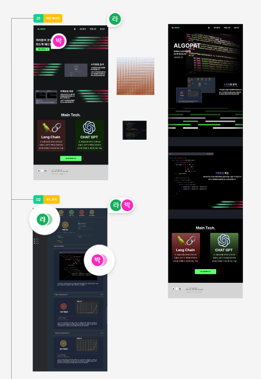
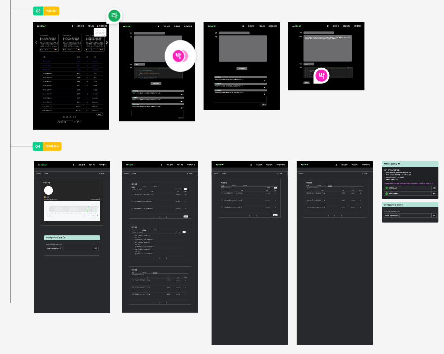

   
##### ChatGPT & LangChain을 활용한 알고리즘 소스코드 효율성 분석 플랫폼  

## 💡 프로젝트 소개 (배경, 개요)

알고리즘 문제를 풀다 보면 효율성 측면에서 소홀한 경우가 많습니다.  
내가 작성한 코드가 시간, 공간 측면으로 효율적인지 코드의 구조와 변수명은 적합한지 알기 어렵습니다.  
누군가 논리적인 근거로 타당한 가이드라인을 제시해 준다면...
##### -> 이와 같은 많은 고민을 해결하기 위해 만든, 알고리즘 소스코드 효율성 분석 서비스입니다.  

## ✨ 프로젝트 주요 기술 

1. 인증/인가
   - Github 소셜 로그인 (OAuth 2.0)
   - JWT (AccessToken, RefreshToken)
   - API Gateway, Eureka  
2. 크롬 익스텐션
   - Crawling (문제, 회원 제출 코드)
   - SSE (실시간 알림)  
3. 알고리즘 소스 코드 분석 
   - 시간 복잡도 (Big O)
   - 공간 복잡도 (Big O)
   - 리팩토링 가이드 
4. 랭킹 
   - 3가지 기준을 통한 순위 (시간 복잡도, 공간 복잡도, 제출 시간)  
   - 내가 푼 문제 열람
5. 마이페이지 
   - 잔디 (제출 일자에 따른 활동 기록)
6. Anomaly (SAGA Pattern : Choreography)
   - 비정상적인 예외현상 발생 시, 보상 트랜잭션 (무료 제출 횟수 +1) 

## 🛠️ 기술 스택

 

 

 
#

 

 

 

   

 <b> 상세 기술스택 및 버전</b> 

| 구분     | 기술스택        | 상세내용           | 버전      |
| -------- | --------------- | ------------------ | --------- |
| 공통     | 형상관리        | Gitlab              | \-        |
|          | 이슈관리        | Jira                | \-        |
|          | 커뮤니케이션    | Mattermost, Notion | \-        |
| BackEnd  | DB              | MariaDB            |     |
|          |                 | JPA                |      |
|          | Java            | Zulu               |  |
|          | Spring          | Spring             |     |
|          |                 | Spring Boot        |      |
|          | IDE             | IntelliJ           | 2022.3.1  |
|          | Build           | Gradle             |        |
|          | API Docs        | Postman            |           |
| FrontEnd | HTML5           |                    | \-        |
|          | CSS3            |                    | \-        |
|          | JavaScript(ES6) |                    | \-        |
|          | React           | React              | 18.2.0    |
|          | Node.js         | npm                | 16.18.0   |
|          | IDE             | Visual Studio Code | 1.75.1    |
| Server   | 서버            | AWS EC2            | \-        |
|          | 플랫폼          | Ubuntu\AWS Liunx   | 20.04 , AWS Linux2|
|          | CI/CD           | Docker             | 20.10.17  |
|          |                 | Jenkins            | jenkins/jenkins:lts|  

## 📆 프로젝트 기간

### 23.4.10 ~ 23.5.19

- 기획 및 설계 : 23.4.10 ~ 23.4.16
- A / B 테스트 : 23.4.17 ~ 23.4.23 
- 프로젝트 구현 : 23.4.24 ~ 23.5.14
- 버그 수정 및 산출물 정리 : 23.5.15 ~ 23.5.19

## 📋 프로젝트 산출물

## 👪 개발 멤버 소개

<table>
    <tr>
        <td height="140px" align="center"> <a href="">
                😶 김소현  (Front-End) </a>  </td>
        <td height="140px" align="center"> <a href="">
                🙂 박동환  (Front-End) </a>  </td>
        <td height="140px" align="center"> <a href="">
                😆 이연학  (Front-End) </a>  </td>
        <td height="140px" align="center"> <a href="">
                👑 이찬희  (Back-End) </a>  </td>
        <td height="140px" align="center"> <a href="">
                😁 이안채  (Back-End) </a>  </td>
		<td height="140px" align="center"> <a href="">
                😶 최웅렬  (Back-End) </a>  </td>
    </tr>
    <tr>
        <td align="center">React Chrome Extension </td>
        <td align="center">React Chrome Extension </td>
        <td align="center">React Chrome Extension </td>
        <td align="center">Spring Boot Fast API </td>
        <td align="center">Spring Boot Fast API </td>
        <td align="center">Spring Boot Fast API CI/CD </td>
    </tr>
</table>

---

### 📋 시스템 아키택쳐

---

### 📋 ERD 다이어그램

---

### 📋 MockUp & Design

---

