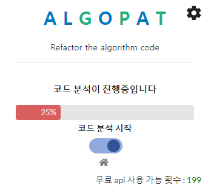
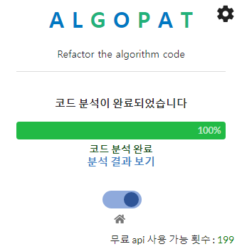
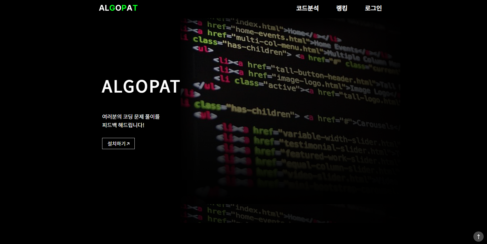
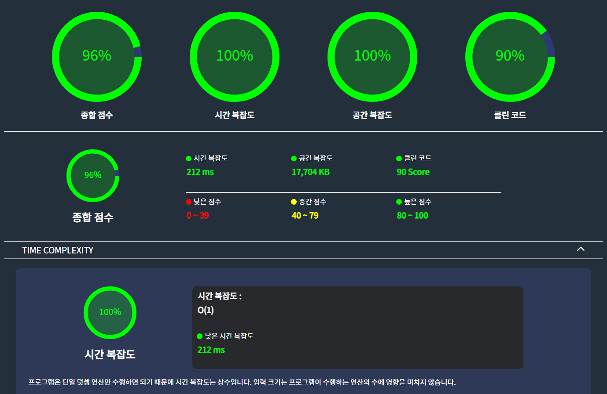
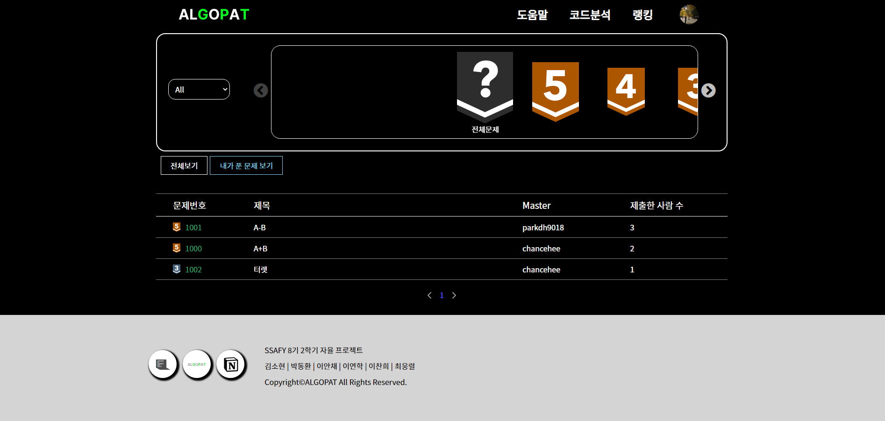
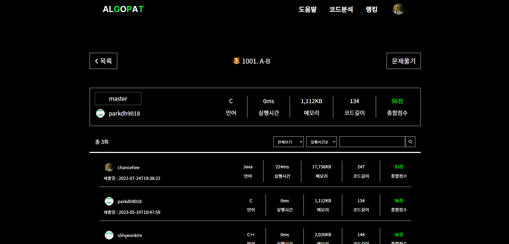
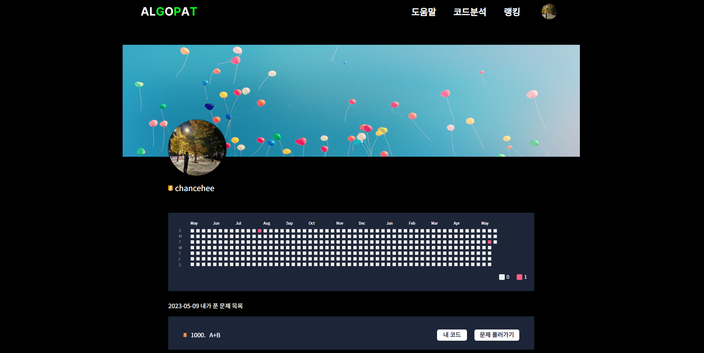
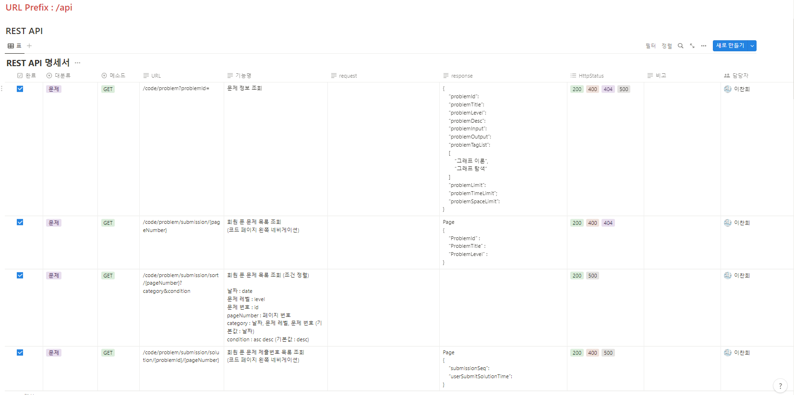
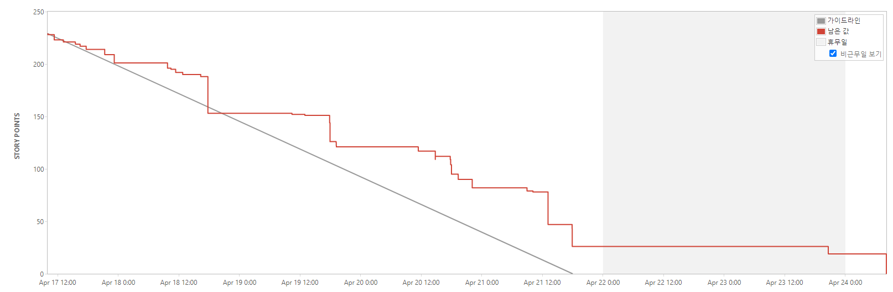
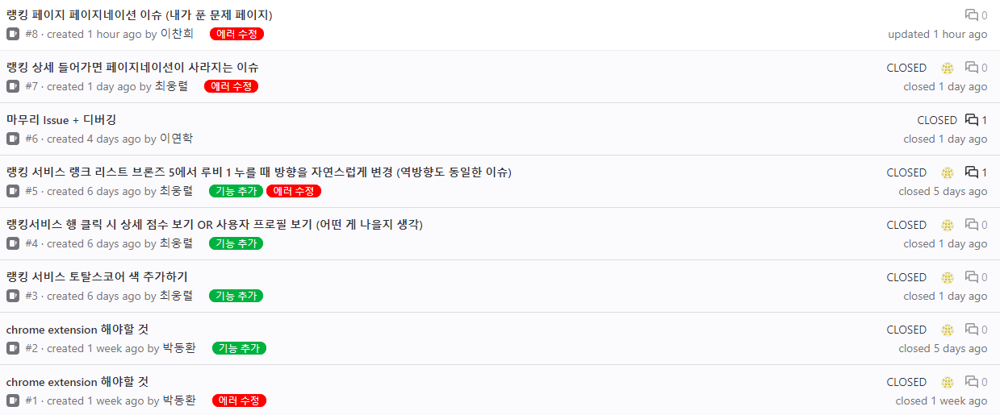

👉👉    
## 🤖ChatGPT & LangChain을 활용한 알고리즘 소스코드 효율성 분석 서비스🤖  
  
## 💡 프로젝트 소개 (배경, 개요)

알고리즘 문제를 풀다 보면 효율성 측면에서 소홀한 경우가 많습니다.  
내가 작성한 코드가 시간, 공간 측면으로 효율적인지 코드의 구조와 변수명은 적합한지 알기 어렵습니다.  
누군가 논리적인 근거로 타당한 가이드라인을 제시해 준다면...
#### -> 이와 같은 많은 고민을 해결하기 위해 만든, 알고리즘 소스코드 효율성 분석 서비스입니다.  

## ✨ 프로젝트 주요 기술 

1. 인증/인가
   - Spring Cloud Gateway, Eureka를 이용한 Client-side Discovery pattern 구현
   - 각 서비스의 호출을 위해 JWT 이용
   - Spring Security 
   - OAuth 2.0  
2. 크롬 익스텐션
   - Crawling (문제, 회원 제출 코드)
   - WebFlux를 이용한 SSE (실시간 알림, 진행상황에 대한 progress bar UI 제공)  
3. 알고리즘 소스 코드 분석 
   - LangChain + ChatGPT 라이브러리를 활용한 코드 분석 
        - 시간 복잡도 (Big O)
        - 공간 복잡도 (Big O)
        - 리팩토링 가이드 
    - 사용자 경험 개선을 위한 무료 OPEN AI API KEY 체험 횟수 10회 제공
    - 비용 절감 및 응답 시간 최적화를 위한 캐싱 적용 (문제 정보)
    - DB 동시성 문제를 해결하기 위한 Redis를 이용한 분산락 구현 
    - Kafka를 통한 로드밸런싱으로 분산 환경에서 시스템 안정성 향상 
4. 랭킹 
   - 3가지 기준을 통한 순위 제공 (총 점수, 시간 복잡도, 제출 시간 기준으로 순위 집계)  
   - 내가 푼 문제 통계 기록 열람 가능 
5. 마이페이지 
   - 잔디 (제출 일자에 따른 활동 기록, 총 제출 횟수에 따른 비례식 적용)
6. Anomaly (SAGA Pattern : Choreography)
   - 비정상적인 예외현상 발생 시, 보상 트랜잭션 적용 (무료 제출 횟수 +1)
   - Kafka 전송 실패를 고려한 Retry 설정 적용 (50번, 10ms) 
7. MSA 구조에서 원활한 디버깅을 위한 Logging 및 Monitoring 환경 구축
    - Zipkin을 이용한 마이크로서비스 환경에서의 추적 시스템 구축 및 시각화
    - 각 서비스에서 발생하는 로그 메세지를 손쉽게 확인할 수 있는 환경 구축 및 시각화
        - FileBeats를 통해 도커 컨테이너의 필요한 로그 선별
        - 선별된 로그 Logstash를 통해 파싱한 후 Elasticsearch에 저장
        - 저장된 로그 데이터를 Kibana에서 시각화를 통해 더 쉽게 로그를 확인할 수 있는 환경을 구축했습니다.

## 🛠️ 기술 스택

 

 

 

 

 

 

   

 <b> 상세 기술스택 및 버전</b> 

| 구분     | 기술스택        | 상세내용           | 버전      |
| -------- | --------------- | ------------------ | --------- |
| 공통     | 형상관리        | Gitlab              | \-        |
|          | 이슈관리        | Jira                | \-        |
|          | 커뮤니케이션    | Mattermost, Notion | \-        |
| BackEnd  | DB              | MariaDB            |     |
|          |                 | JPA                |      |
|          | Java            | Zulu               |  |
|          | Spring          | Spring             |     |
|          |                 | Spring Boot        |      |
|          | IDE             | IntelliJ           | 2022.3.1  |
|          | Build           | Gradle             |        |
|          | API Docs        | Postman            |           |
| FrontEnd | HTML5           |                    | \-        |
|          | CSS3            |                    | \-        |
|          | JavaScript(ES6) |                    | \-        |
|          | React           | React              | 18.2.0    |
|          | Node.js         | npm                | 18.14.2   |
|          | IDE             | Visual Studio Code | 1.78.2    |
| Server   | 서버            | AWS EC2            | \-        |
|          | 플랫폼          | Ubuntu\AWS Liunx   | 20.04 , AWS Linux2|
|          | CI/CD           | Docker             | 20.10.17  |
|          |                 | Jenkins            | jenkins/jenkins:lts|  

## 📆 프로젝트 기간

### 23.4.10 ~ 23.5.19

- 기획 및 설계 : 23.4.10 ~ 23.4.16
- A / B 테스트 : 23.4.17 ~ 23.4.23 
- 프로젝트 구현 : 23.4.24 ~ 23.5.14
- 버그 수정 및 산출물 정리 : 23.5.15 ~ 23.5.19

## 📋 상세 페이지  
### 크롬 익스텐션
   
### 메인 페이지  
  
### 코드 분석 결과 페이지  
  
### 랭킹 페이지  
  
### 랭킹 상세 페이지  
  
### 마이페이지  
  

## 👪 개발 멤버 소개

<table>
    <tr>
        <td height="140px" align="center"> <a href="">
                😶 김소현  (Front-End) </a>  </td>
        <td height="140px" align="center"> <a href="">
                🙂 박동환  (Front-End) </a>  </td>
        <td height="140px" align="center"> <a href="">
                😆 이연학  (Front-End) </a>  </td>
        <td height="140px" align="center"> <a href="">
                👑 이찬희  (Back-End) </a>  </td>
        <td height="140px" align="center"> <a href="">
                😁 이안채  (Back-End) </a>  </td>
		<td height="140px" align="center"> <a href="">
                😶 최웅렬  (Back-End) </a>  </td>
    </tr>
    <tr>
        <td align="center">React Chrome Extension </td>
        <td align="center">React Chrome Extension </td>
        <td align="center">React Chrome Extension </td>
        <td align="center">Spring Boot Fast API </td>
        <td align="center">Spring Boot Fast API </td>
        <td align="center">Spring Boot Fast API CI/CD </td>
    </tr>
</table>

---

### 📋 시스템 아키택쳐

---

### 📋 ERD 다이어그램

---

## 👥 협업 관리  

<table>
    <tr>
        <td  align="center">
                노션  
        </td>
        <td align="center">
                지라  
        </td>
        <td align="center">
                깃랩 이슈  
        </td>
    </tr>
</table>
