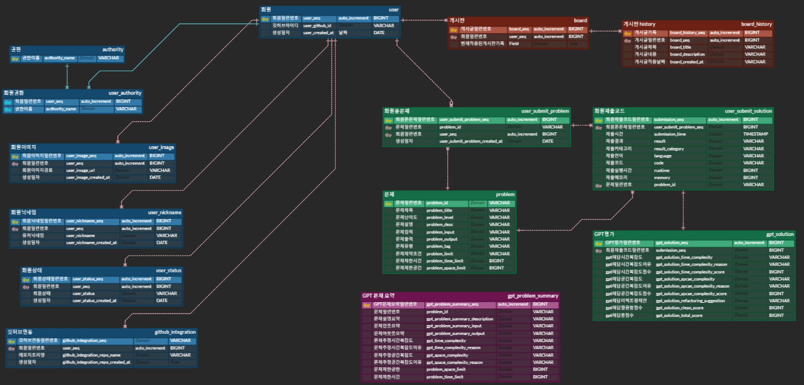

# AlGoPaT

  
ChatGPT & LangChain을 활용한 알고리즘 소스코드 효율성 분석 플랫폼

프로젝트 URL : [AlGoPaT](https://algopat.kr)

프로젝트 UCC : [AlGoPaT - UCC]("")

프로젝트 기간: 2023.04.10 ~ ing

## 프로젝트 소개 (배경, 개요)

알고리즘 문제를 풀다 보면 효율성 측면에서 소홀한 경우가 많습니다.  
내가 작성한 코드가 시간, 공간 복잡도 측면으로 효율적인지 코드의 구조와 변수명은 적합한지 알기 어렵습니다.  
누군가 논리적인 근거로 타당한 가이드라인을 제시해 준다면, 좋을 것입니다.  
저희 프로젝트는 이러한 불편함에서 시작했습니다.

## 프로젝트 주요 기능

- 시간 복잡도
- 공간 복잡도
- 리팩토링 가이드

## 프로젝트 주요 기술

1. 인증/인가
   - 깃허브 소셜 로그인 : OAuth 2.0 사용
   - JWT를 사용한 인가 기능
   - Spring Security를 활용한 인증/인가 제어
2. 크롬 익스텐션
3. 알고리즘 소스 코드 분석
4. 게시판

## 사용 기술

- 이슈 관리 : Jira
- 형상 관리 : Git, Gitlab
- 의사소통, 협업: Notion, Mattermost, Discord
- 개발환경
  - OS : Window10
  - IDE : Intellij, VSCode
  - EC2 : Ubuntu 20.04 LTS (GNU/Linux 5.4.0-1018-aws x86_64)
  - Database : Mariadb 10.6
  - SSH : Windows Terminal, MobaXterm
  - CI/CD : Jenkins
  - Reverse Proxy : Nginx
  - SSL : CertBot, Let's Encrypt
- 프론트엔드 (React)
  - Typescript
  - React
  - Recoil
  - React-Query
  - Vite
  - sockjs-Client
- 백엔드 (SpringBoot)
  - Springboot Starter Data JPA
  - Springboot Starter Security
  - JWT
  - Apache Kafka
  - google http client gson
  - jsoup
  - lombok
  - spring boot devtools
  - mariadb java client
  - Redis
- 백엔드 (FastAPI)
  - asyncio
  - pydub
  - MariaDB
  - Apache Kafka
  - gunicorn
  - uvicorn
  - Chat GPT API
  - LangChain 라이브러리
  - Redis

## 프로젝트 파일 구조

### 백엔드(Spring Boot)

### 프론트엔드

### 백엔드(Fast API)

## 역할 분배

| 이름   | 사진                          | 역할       | 정보                         |
| ------ | ----------------------------- | ---------- | ---------------------------- |
| 이안채 |  | 백엔드     | SpringBoot / FastAPI         |
| 이찬희 |  | 백엔드     | SpringBoot / FastAPI         |
| 최웅렬 |  | 백엔드     | SpringBoot / FastAPI / CI/CD |
| 이연학 |  | 프론트엔드 | React                        |
| 박동환 |  | 프론트엔드 | React                        |
| 김소현 |  | 프론트엔드 | React                        |

## 프로젝트 산출물

### 기능 기획서

---

### 시스템 아키택쳐

---

### API 명세서

---

### ERD 다이어그램

---

### MockUp & Design

---

## 서비스 동작 이미지와 설명

## 프로젝트 참고 링크

- [프로젝트 Notino](https://www.notion.so/ramen-buang/SSAFY-2-ALGOPAT-dbb58b913794443d8592f46eca0477be) AlGoPaT
- [GitHub - Link](자기 githut 링크) 포트폴리오 Github Link
